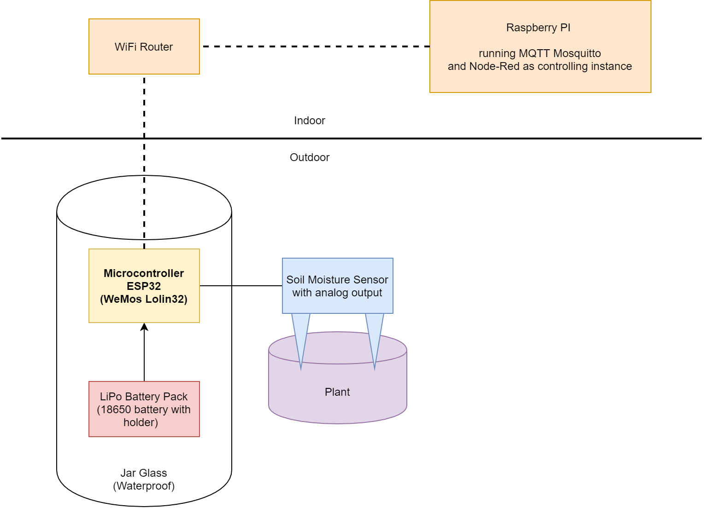

= ESP Moisture Sensor for Plants

An ESP-Powered moisture sensor for plants.

Also checkout my other project https://github.com/5erv3/esp-gardener[ESP gardener] for automatic watering.

== Installation

* Install latest Arduino IDE
* Install ESP https://github.com/espressif/arduino-esp32/blob/master/docs/arduino-ide/boards_manager.md[library] for Arduino
* Select the correct board in IDE
* Copy config.h.example to config.h and modify the neccessary values
* Upload and start!

== Overview

*Notes:*

* I am currently using a moisture sensor with resistive sensitivity, because the capacitive ones need >3.3V to operate.
* The power for the soil moisture sensor is delivered through a GPIO of the ESP32 to save power when not measuring.
* With the currently used battery in a bad WiFi environment and hourly moisture updates I got through 7 months without recharging the battery.

